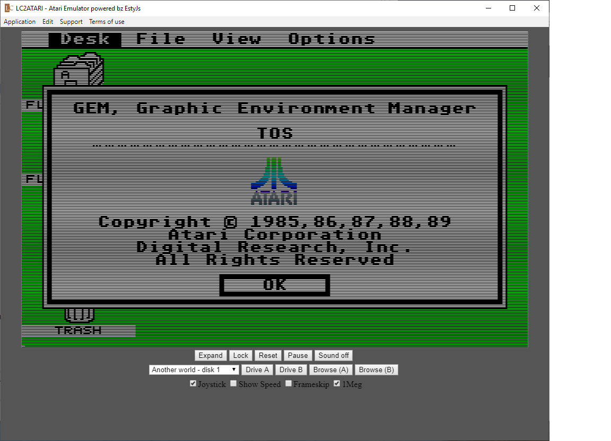

<h1>LC2ATARI</h1>
Atari ST 520/1040 Emulator
Source:
http://letztechance.org

Based on 
http://estyjs.azurewebsites.net/
 

## What is "LC2ATARI" app?

A simple desktop application to emulate Atari ST 520/1040 Emulator.

A simple desktop application to emulate Atari ST 520/1040 Emulator.
- no roms included. Use for example:https://github.com/dmcoles/EstyJs
Browser for roms on "Drive A" or "Drive B"

a litte ts demo included based done by David Honisch
Powered by http://phaser.io

## Supported os

Current build is only compiled for Microsoft Windows OS.

## Download

- Free
- No ads

Find your download: [https://github.com/David-Honisch/LC2ATARI](https://github.com/David-Honisch/LC2ATARI)

## Change log

##### 1.1.0
Emulate Atari ST 520/1040 Emulator
- tos.img required

##### 1.0.0
LC2ATARI/EstyJS - Javascript based Atari ST 520/1040 emulator 

## Disclaimer

1. Please use this app for downloading only public resources.
2. The app doesn't store ANY media files ANYWHERE except on the device who use this app.

  Icons made by <a href="https://www.flaticon.com/authors/pixel-perfect" title="Pixel perfect">Pixel perfect</a> from <a href="https://www.flaticon.com/" title="Flaticon">www.flaticon.com</a> is licensed by <a href="http://creativecommons.org/licenses/by/3.0/" title="Creative Commons BY 3.0" target="_blank">CC 3.0 BY</a>

## Development
	npm i
    npm run webpack
    npm run electron

### Stack

- [electron](http://electronjs.org/)
- [reactjs](https://reactjs.org/)
- [typescript](https://www.typescriptlang.org/)
- [webpack](https://webpack.js.org/)
- [jquery]jquery
- [estyjs]estyjs
#### Tests

- [jest](https://jestjs.io/)

#### Libraries

- [estyjs](http://estyjs.azurewebsites.net/)
- [yestyjs](https://github.com/dmcoles/EstyJs)

### TODO
[sync sound]Sound is not optimized...
[project]Thanks you for your willing to contribute page.
[baseproject](http://estyjs.azurewebsites.net/) page.

## License
MIT